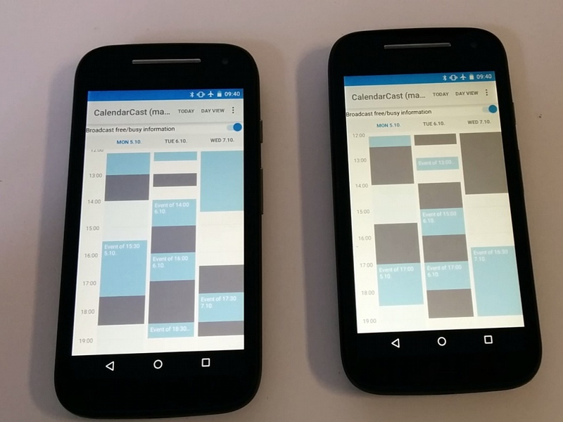

CalendarCast
============

Companion repository to the research paper presented at CHI 2016: https://dl.acm.org/citation.cfm?id=2858100

This prototype implementation is based on Android-Week-View from https://github.com/alamkanak/Android-Week-View

We introduce CalendarCast, a novel method to support the common task of finding a suitable time and date for a shared meeting among co-located participants using their personal mobile devices. In this paper, we describe the Bluetooth-based wireless protocol and interaction concept on which CalendarCast is based, present a prototypical implementation with Android smartphones and dedicated beacons, and report on results of a user study demonstrating improved task performance compared to unaugmented calendars. The motivating scenario for CalendarCast occurs quite often in a variety of contexts, for example at the end of a prior meeting or during ad-hoc conversations in the hallway. Despite a large variety of digital calendar tools, this situation still usually involves a lengthy manual comparison of free and busy time slots. CalendarCast utilizes Bluetooth Low Energy (BTLE) advertisement broadcasts to share the required free/busy information with a limited, localized audience, on demand only, and without revealing detailed personal information. No prior knowledge about the other participants, such as email addresses or account names, is required.
